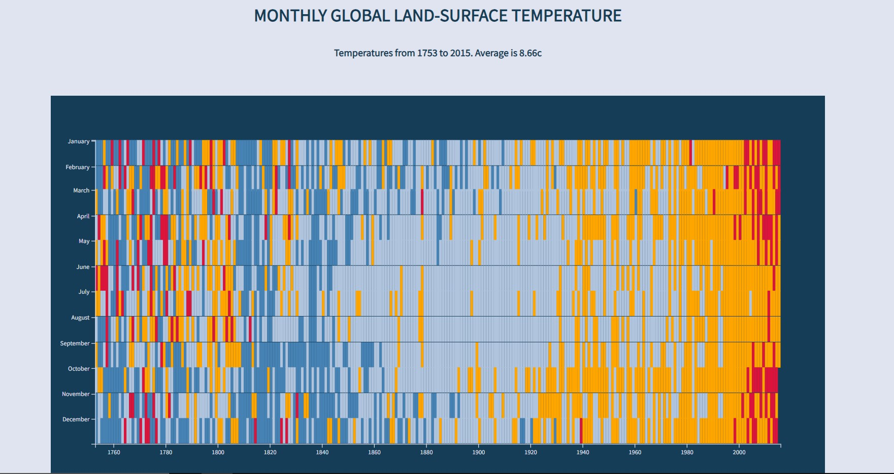

# Heat Map Visualization
This project is a data visualization of global temperature using D3.js. It displays the monthly variations in temperature over the years and provides an interactive visualization for users to explore the data.

## Preview


## Getting Started
### Prerequisites
- Web browser (Chrome, Firefox, Safari, etc.)

### Installation
1. Clone the repository:
   ```bash
   git clone https://github.com/your-username/global-temperature-visualization.git
2. Navigate to the project directory:
   ```bash
   cd global-temperature-visualization
3. Open index.html in your preferred web browser.

### Features
- Interactive visualization of global temperature data: Users can interact with the visualization by hovering over data points to view detailed information, such as the year, month, temperature, and variance.

- Different colors indicating temperature variance: The visualization uses different colors to represent temperature variances. Cooler temperatures are displayed in blue shades, while warmer temperatures are shown in orange and red shades.

- Tooltip displaying detailed information for each data point: When users hover over a data point, a tooltip appears, providing additional details about the temperature for that specific month and year.

- Scalable and responsive design: The visualization is designed to be scalable and responsive, allowing it to adapt to different screen sizes and devices.

### Technologies Used
- HTML5
- CSS3
- JavaScript
- D3.js (Data-Driven Documents)

## Data Source
The data used for this visualization is sourced from [freeCodeCamp](https://www.freecodecamp.org/)'s [Project Reference Data](https://github.com/freeCodeCamp/ProjectReferenceData) repository. The specific dataset used is [global-temperature.json](https://raw.githubusercontent.com/freeCodeCamp/ProjectReferenceData/master/global-temperature.json).

## Contributing
Contributions are welcome! If you encounter any issues or have suggestions for improvements, please feel free to open an issue or submit a pull request.

## Credits
This Heat Map project is part of the [FreeCodeCamp Data Visualization Certification](https://www.freecodecamp.org/learn/data-visualization/) course. It was completed as one of the required projects in the curriculum.

Special thanks to freeCodeCamp for providing educational resources and coding challenges to help developers learn and improve their skills.

### Resources
- [D3.js](https://d3js.org/): A powerful JavaScript library for creating data visualizations in the browser.
- [freeCodeCamp](https://www.freecodecamp.org/): An open-source community that offers a platform for learning web development through hands-on coding projects.

